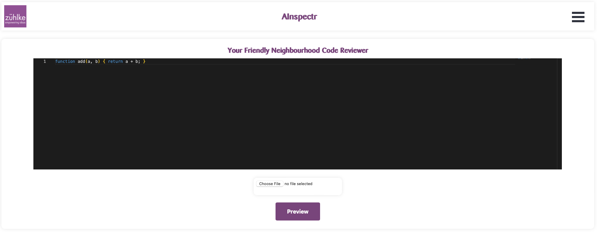

# AInspectr - Your Friendly Neighbourhood Code Reviewer

---
Welcome to *AInspectr - Your Friendly Neighbourhood Code Reviewer*.
*AInspectr* is a 
This repository contains the source code and documentation of our project for the Zühlke Java Fullstack Hackathon 2024. We have used the following technologies:

- Java in the backend
- React in the frontend
- The OpenAI API 

## Key Features
* *Code Input*: You can insert your code either directly into the editor or upload a file for reviewing.
* *Data Sanitization*: You can select privacy sensitive parts (such as method names, variable names, hardcoded values, etc.) and map replacement values so that no sensitive data is sent to the OpenAI API.
* *Preview*: Before submitting the code to be reviewed, you can have a look at the sanitized code.
* *Review*: You can submit your previewed code to be reviewed and will receive the output with clear commentary on suggested changes, improvements and additional notes.

## How to Use
See the [Setup README](./SETUP_README.md) for further instructions on getting this project up and running.